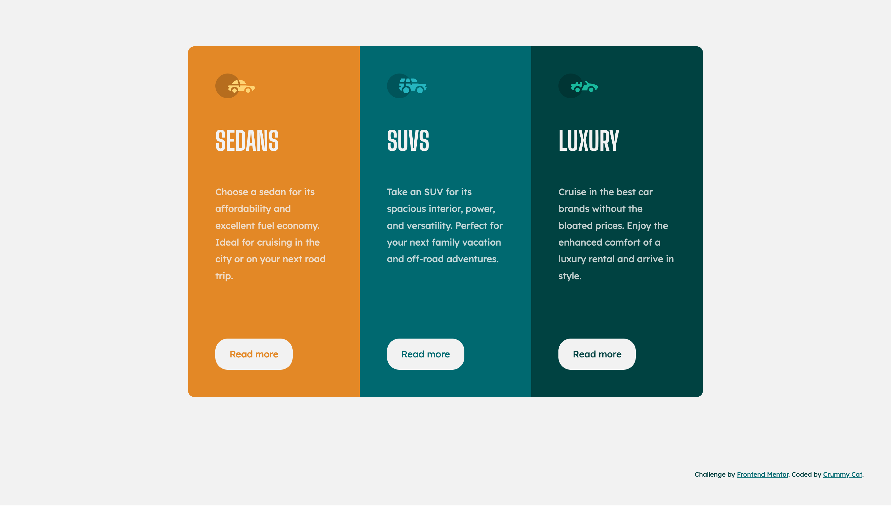

# Frontend Mentor - 3-column preview card component solution

This is a solution to the [3-column preview card component challenge on Frontend Mentor](https://www.frontendmentor.io/challenges/3column-preview-card-component-pH92eAR2-). Frontend Mentor challenges help you improve your coding skills by building realistic projects.

## Table of contents

- [Overview](#overview)
  - [The challenge](#the-challenge)
  - [Screenshot](#screenshot)
  - [Links](#links)
- [My process](#my-process)
  - [Built with](#built-with)
  - [Useful resources](#useful-resources)
- [Author](#author)

## Overview

### The challenge

Users should be able to:

- View the optimal layout depending on their device's screen size
- See hover states for interactive elements
- Accessible card

### Screenshot

### Links

- Solution URL: [Github](https://github.com/crummycat/fm_3_column_preview_card_component)
- Live Site URL: [Github Page](https://crummycat.github.io/fm_3_column_preview_card_component/)

## My process

### Built with

- Semantic HTML5 markup
- CSS custom properties
- CSS animations
- Flexbox
- CSS Grid
- Mobile-first workflow
- Accessible cards

### Useful resources

- [How to build accessible cards–block links](https://www.nomensa.com/blog/how-build-accessible-cards-block-links) - This helped me for XYZ reason. I really liked this pattern and will use it going forward.
- [Get rid of the flash of unstyled content](https://medium.com/@fbnlsr/how-to-get-rid-of-the-flash-of-unstyled-content-d6b79bf5d75f)
- [Transitions Only After Page Load](https://css-tricks.com/transitions-only-after-page-load/)

## Author

- Frontend Mentor - [@crummycat](https://www.frontendmentor.io/profile/crummycat)
